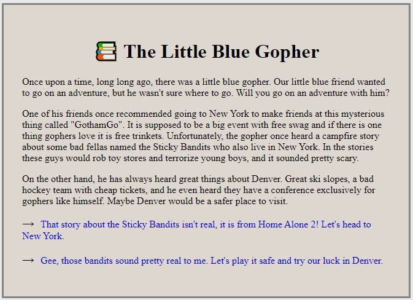

# Go-CYOA
Choose your adventure GoLang practice project

## Demo


## Console Output

Here is the sample output after adding the MUX
```
> go run .\cmd\cyoaweb\main.go
Starting the Server on port 8000
2021/11/01 14:05:32 Got Request for page '/new-york', Serving from defaultMux 
2021/11/01 14:05:40 Got Request for page '/debate', Serving from defaultMux 
2021/11/01 14:05:42 Got Request for page '/mark-bates', Serving from defaultMux 
2021/11/01 14:05:44 Got Request for page '/home', Serving from defaultMux 
2021/11/01 14:05:50 Got Request for page '/story/intro', Serving from StoryMux 
2021/11/01 14:05:54 Got Request for page '/story/denver', Serving from StoryMux 
2021/11/01 14:05:56 Got Request for page '/story/home', Serving from StoryMux 
exit status 0xc000013a
> 
```

Note: This is my practise version of one of the execerises from *gophercises*